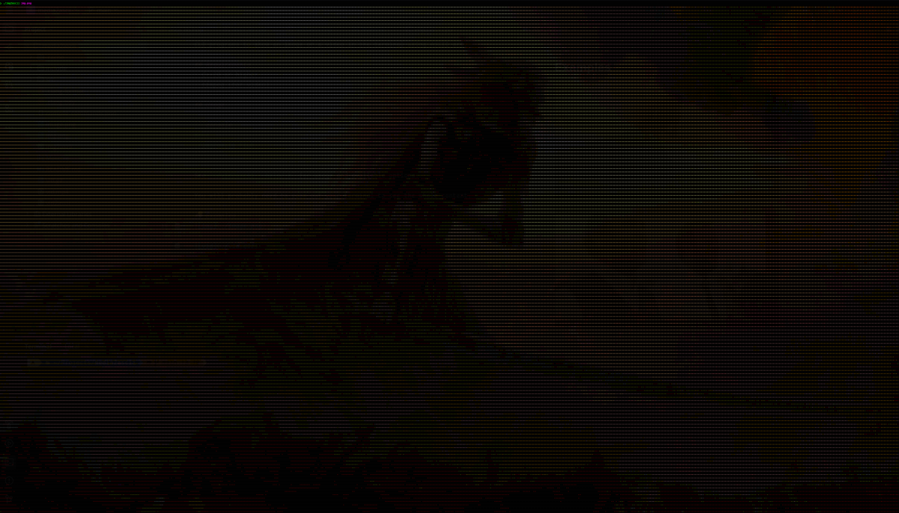

CLI programs to show an image or a video in the terminal using ASCII art.

## Requirements
- C++20 or higher
- ffmpeg (for video)

## Usage

```console
make
./img2ascii FILE
```

See `./vid2ascii --help/-h` for usage and available options.

You will probably need to zoom out your terminal to see the whole content.

## Examples



